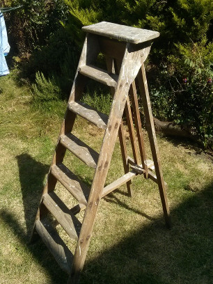
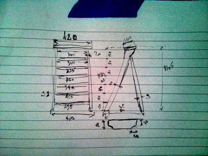

# ladder-planter
Project to transform a painter's ladder into a vertical planter for the garden.

The previous owner of my house left a painter's ladder in the shed. It's
obviously been used for its intended purpose quite a bit. However, I am no
decorator and want to use the ladder for something useful rather than let it
rot in the shed.

The basic idea is to create some planters that will fit on the rungs of the
ladder so that I can plant herbs and small plants in them.

## Dimensions

All dimensions expressed in millimeters.

